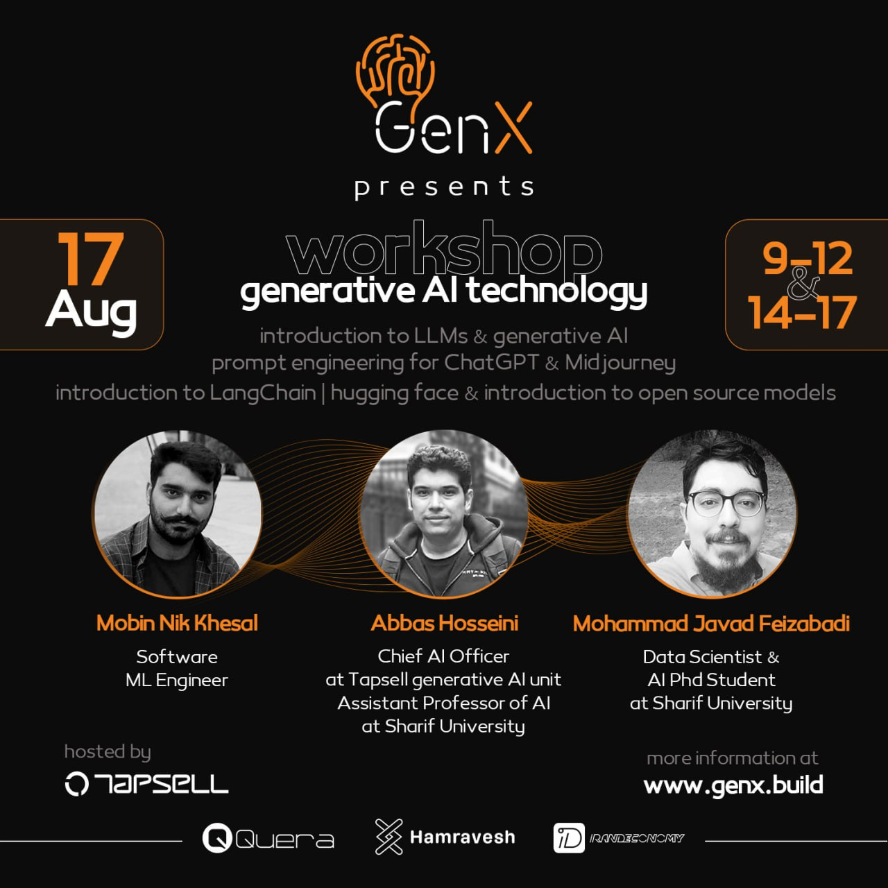

# genx-workshop

Welcome to the GenX Workshop: Introduction to Generative AI for Beginners! In this workshop, we will dive into the fascinating world of generative artificial intelligence (AI) and explore how computers can create new content, such as images, music, and text, on their own.

- Workshop Name: GenX: Introduction to Generative AI technology
- Date: [2023-08-17]
- Time: [9-12,14-17]
- Location: [online(skyRoom)]

## morning workshop

[content]

## afternoon workshop(14-17)

 In this engaging afternoon session (14:00 - 17:00), we will delve into the captivating realm of generative artificial intelligence (AI)
and uncover how computers can autonomously create diverse content.

All codes that exist within branches starting with 'ws2/' are located. To watch the video, please visit the following [link](wwww.sth.com)

## Contact Us

If you have any questions  after the workshop, feel free to reach out to us at [your email address].

We're excited to embark on this generative AI journey with you at the GenX Workshop! Let's explore the creative capabilities of AI together.
